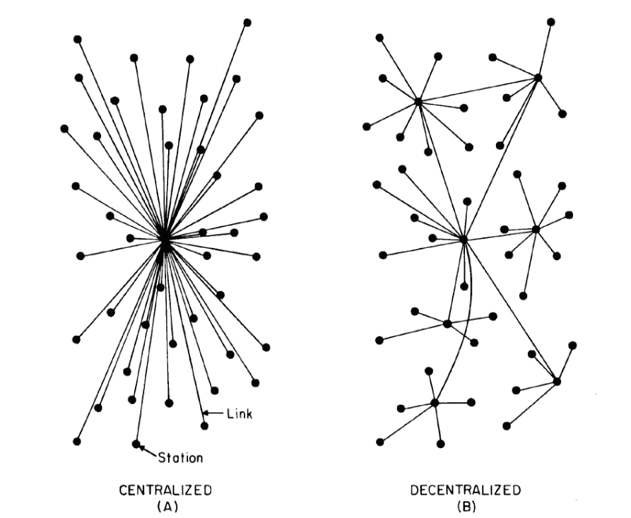

## The Project

The final year project is a year long module that tasks a student to propose a project idea of their own volition or to select a project proposed by a lecturer from the school of computing. The module itself is worth 15 credits and given that final year is worth 85% of the total degree, it would mean that the project accounts for 21.25% of the degree also. To go with this fact, the project is also to be entered in an expo at the end of the second semester. This would also mean highlighting the set of skills and knowledge learned throughout the degree to potential employers post-degree.

Therefore, it is imperative to make a project of as high a standard as possible but also one that reflects your own personal technology related interests.

## The Blockchain

"Blockchain" is the underlying technology behind *cryptocurrencies* such as Bitcoin and Ethereum. In a sentence it enables decentralized consensus across a peer-to-peer network of user nodes ensuring immutability of data by using an open, distributed ledger that can record transactions between two parties efficiently and in a verifiable and permanent way. In laymans terms, its a ledger which everyone publicly agrees on and adheres to. Conceptualised by a "Satoshi Nakamoto" in 2008, [Bitcoin](https://bitcoin.org/bitcoin.pdf) was invented as a solution to the double-spending problem without trusted authority. Other implementations of cryptocurrencies using the blockchain spun-off this idea and now exist in their hundreds. 
Currently I have been investigating cryptocurrencies and blockchain for the past few months with this project in mind to create an application using this technology. I believe that the use of decentralised consensus far exceeds that of currency and will provide better solutions to societal agreement across governance, healthcare and legal professions. 

E-voting is an application  which I believe blockchain technology can be used to provide a secure solution.

## Electronic Voting

> It's not the people who vote that count, it's the people who count the votes." - Joseph F Stalin

Electronic voting refers to voting using electronic means to cast and count the votes by the use of electronic machines or computers, both using the internet to relay the voter's vote . 

Traditionally, voting has been a paper based system and still is in Ireland and in the majority of countries around the world. In the system, the voter must attend a polling station where he/she can privately mark a ballot-paper/voting card with their elected choice and is then observed by an authority in making that vote by dropping the slip into a ballot-box. The responsibility of that ballot-box lies then with that authority, (usually a government official) in its safety, transportation and counting. 

Usually this works but in reference to the initial quote, a great amount of responsibility is put in the hands of central authority who administers the vote. By generating a different system where the integrity of a vote remains intact and verifiable without having to trust an authority to oversee the outcome is by far a better democratic solution.  An e-voting system if employed correctly ought to achieve this goal as well as saving on taxpayer's money at the same time.

Electronic voting systems began in the 1960's where punched card systems were used for electorates. Newer systems were introduced that aided in the counting of the votes using optical scanning systems that detected marks on ballot-papers. Electronic voting machines were trialled in Ireland in the early 2000s but were [scrapped](http://www.independent.ie/irish-news/54m-voting-machines-scrapped-for-9-each-26870212.html) due to the lack of verifiability at the cost of 54 million euro.

Brazil and India employ the use of DRE-voting machines (direct-recording electronic) which both collect and tabulate votes per machine. Votes are entered by means of a touchscreen display or buttons. After the election it produces a record of the voting data in a removable memory component and as a printed document and this information is passed on to central authority. This machine was able define a result of an electorate of 135 million people in 75 minutes for the 2010 brazilian presidential election.
Another system is the Public network DRE system which works similarily but dispatches the election result over the internet from the polling station to another location. Other implementations of voting through email services, or government websites with user pins have also been tried which would allow voters to vote from home.

#### Benefits

Advantages to e-voting systems are well documented:

- By using an electronic means to cast a vote, dependent on how the election registration process works, a voter may have access to a voter verifiable paper trail where they can self-identify that their vote was cast correctly. 

- E-voting potentially increases voter turnout which solidifies the democratic process and makes for stronger governments.

- Decreases the likelihood of election fraud by eliminating ballot-tampering.

- Proposes a viable solution to voter turnout in lower populated and isolated areas.

- Less expensive on the tax-payer as paper-ballot elections cost countries millions of dollars to finance. 

However, past implementations of e-voting systems have not proven to be more secure than traditional ballot-paper. 

#### The problem

- *Vote integrity and transparency* - An issue with a lot of implementations of e-voting systems is that they are developed "closed-source" where the software that the system uses is propietrary of a third party outside of the government and the voters. Essentially, this means that trust must be given to the third-party which is not ideal and is no better than the paper-ballot system where trust is still placed in those who count the votes. 

- *Electronic tallying* - As with the paper-ballot, counting of the votes is gathered in a single location. Any voting system that implements use of the web to tranfer vote data to a central server is ultimately no different than that of physically transferring a ballot-box to a tallying centre. If a hardware failure occurs however it may prove worse than the paper-ballot as the votes could be irreversibly lost.

- *Opportunities for fraud* - The single best reason for not implementing an e-voting system is due to the level of exposure to grand-scale fraud. Opportunities for fraud in paper-ballot systems are less impactful on the overall election as there are many human points of contact between the voting data (ballot-paper) and the tallied result. In an electronic system where malicious attackers can and we assume do occur could expose weaknesses in software that could go unforseen. 

Incidents of failures with e-voting are numerous and no one true fully secure and verifiable system is said to exist.

## Blockchain in e-voting

Shortcomings of traditional e-voting systems have been based around a model of a central tallying server with access nodes of aformentioned DRE machines or voting terminals in polling stations. From a technical security standpoint, the system has exposure in the fact that it is a centralised hierarchial structure. If the central node within the system, (the tallying server) is compromised, then the election fails completely. With each polling station, if a voting machine has a fault or the transfer of the vote data is insecure then the votes for that constituency could also be lost. 

The above image visualises a centralised network and how it is totally reliant on the central node. Also shown is a decentralized network which is the underlying structure of a blockchain network. With Bitcoin, Ethereum and all other cryptographic-currencies that have this structure, I believe a more secure and improved system of e-voting can be created. By removing the central point of control within the traditional system of tallying the votes and providing a verifiable, transparent way for any voter to monitor their votes while remaining anonymous themselves is the intention of this project.

Blockchain in its application with cryptocurrencies functions by storing information of transactions on a ledger by a collective verification process. This verification process means that users within the network gain full knowledge of transactions between users of the system but all remain anonymous as every user is identified as a cryptographic hash. How these transactions are processed is a complicated process that makes use of cryptographic protocols and game-theory. At a high-level, certain nodes called *miners* collect transaction records which are broadcasted by those nodes who wish to make a transaction. The miners then group these transaction records into a *block* and one block is picked at random to be added to the blockchain which is the collection of all transactions or the ledger as alluded to. For the miners work, they receive a small portion of cryptocurrency and the process repeats. 

How, this is to be applied to an e-voting system is that instead of transactions of coinage, users making a transaction will be voters and the cryptocurrency unit will be a vote. 

#### Ethereum

Ethereum is a distributed public blockchain network like Bitcoin but is very different. Bitcoin is described as a peer-to-peer electronic cash system, a single application of the blockchain. Ethereum on the other hand is a platform where someone can create a decentralized application and use the blockchain network to execute it at a cost of Ether, (which is the store of value Ethereum uses), to pay for transaction fees and services.
The decentralized application or *dapps* as they are called in Ethereum make use of code called *Smart contracts* which are executable on the blockchain. Simply, the Ethereum blockchain analoguos to a decentralized computer. There exist a plethora of videos that explain blockchain and Ethereum to various levels of intricacy but the video below gives a high-level introduction from the founders themselves, Professor Gavin Wood and Vitalik Buterin.

<iframe width="560" height="315" src="https://www.youtube.com/embed/eRDKP8nCVtU" frameborder="0" allowfullscreen></iframe>

Having a decentralized virtual computer that exists on a cryptographically secure, tamper-proof network is a viable solution to the e-voting problem. The full blockchain ledger is fully [transparent](https://etherscan.io/) allowing anyone anywhere at anytime being able inspect their past transaction history. The opportunity for election fraud/hacking is also minimised as it would require enormous computational power to override the chain. ([51% attack](http://www.investopedia.com/terms/1/51-attack.asp)). The tallying of votes is fully viewable and if the software implemented is open-source then voters can be assured of full end-to-end transparency.

#### Other Blockchain Voting Implementations

There have been some applications of voting systems using blockchain technology and Ethereum which I will now investigate and explain.

- [Open Vote Network](https://github.com/stonecoldpat/anonymousvoting) was developed by three Newcastle University students, Patrick McCorry, Siamak F. Shahandashti and Feng Hao and defined their voting protocol in this [paper](http://fc17.ifca.ai/preproceedings/paper_80.pdf). I found their protocol to be the most interesting as it provided all relevent requirements to a secure and verifiable self-tallying democratic election. However, they implemented it on a scale for a boardroom election and had a maximum 50 voters per election. They also implemented a really clever idea in the registration of voters where the voters are enforce to make a refundable deposit. In the event of voters not voting, the deposits would be given to a charitable organization. I found this to be a very good idea to increase voter turnout.

- [FollowMyVote](https://followmyvote.com/#) are a company that uses a public blockchain as a ballot-box and allows voters to vote securely using a Voter ID and a webcam to verify their identity. The system provides security by having a human identification process and providing a corresponding voting key to make the vote. Concerns of using a single-purpose blockchain is of issue as the miners who secure the network have no financial incentive in securing it like they do in Ethereum and Bitcoin. One interesting feature they employed was allowing voters to switch their vote in the timeframe of the election.

- [TIVI](https://tivi.io/tivi/) is a closed-source remote-voting application that uses blockchain as a searchable index. It works by users voting through a website and Tivi, the authority shuffles the votes and stores them on the blockchain. In this case, the voter must trust the central authority that the integrity of the election is upheld.

- A former DCU student, [Michael Wall](https://github.com/CPSSD/voting) implemented a voting system that worked using his own custom made blockchain for his project last year. The purpose of this system was to create a blockchain as opposed to creating a voting application on top of the Ethereum network.

My understanding from investigating these projects is that the Open Vote Network is the most complete with regards to election integrity. That being said it has drawbacks in two areas in my opinion.

- The election is a plurality voting system where the highest amount of votes wins and the voters elect on the basis of a motion. The implemented design is a single string motion and the voters say yes or no to that motion. 
- The maximum numbers of voters possible within a single election is capped at 50. This is due to the cost it takes to execute programs on the network and a set gas limit. However, they do stipulate that *"the contract can be modified to perform the processing in batches and allow multiple transactions to complete the task"*. 

## My proposal

With any election system, the base underlying structure is made of three things, the proposal, the candidates and the voters choice. These can mean different things. For example, a general election in the Republic of Ireland is called an *Instant-Runoff Majoritarian* system where candidates are elected in preference and candidates must receive a majority of the votes to be deemed elected. This can be described as:

- **The Proposal** - Who should be elected to government?
- **The Candidates** - Politicians
- **The Voters Choice** - Order in preference 1 to n candidates.

A referendum in the Republic of Ireland obeys the same structure:

- **The Proposal** - Should motion X be repealed/written from/to the constituition?
- **The Candidates** - Yes / No
- **The Voters Choice** - Pick one

British MP's are elected in a plurality system. Their election process also obeys the same structure:

- **The Proposal** - Who should be elected to government?
- **The Candidates** - Politicians
- **The Voters Choice** - Pick one.

There are many electoral systems used by different countries around the [world](https://en.wikipedia.org/wiki/List_of_electoral_systems_by_country) and all have these three concepts at their root. These 3 core concepts will serve as the base structure for a higher-level system which can allow users generate their own election models and them implement them.

#### Proposal

>
**My proposal is to create a smart contract that allows users to dynamically generate their own electoral system using the Ethereum blockchain. With the many electoral systems used in governance and democratic processes, it makes sense to allow electoral administrators design elections to fit their needs whilst also providing the security and transparency of blockchain technology.**
